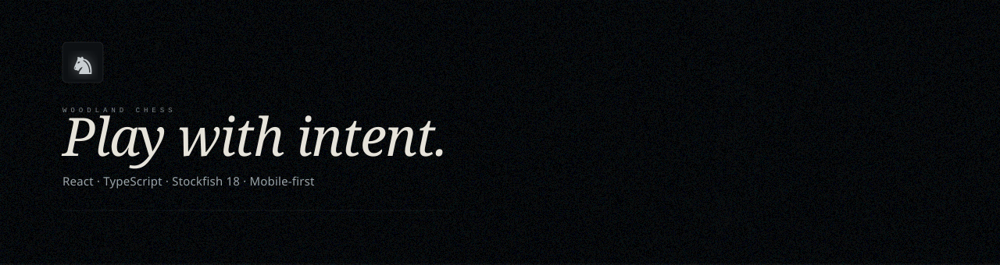
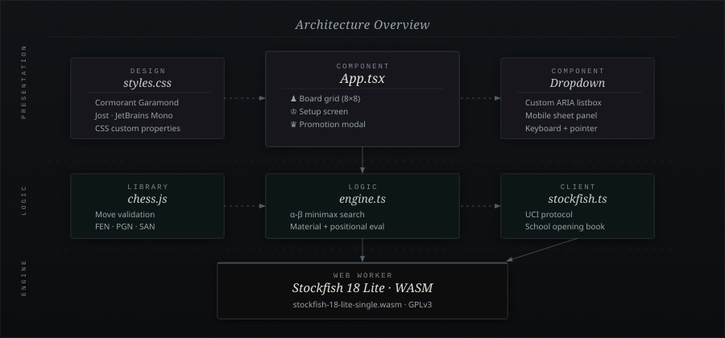
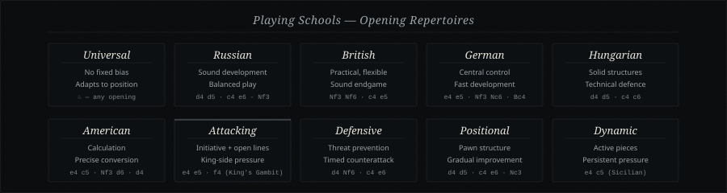

<div align="center">



<br/>

<!-- Badges row 1 — status -->


<!-- Badges row 2 — stack -->


<!-- Badges row 3 — deploy & quality -->


<br/>

> *A chess game forged in React and TypeScript, powered by Stockfish 18, designed for intent.*

<br/>

</div>

---

## ♟ Overview

**Woodland Chess** is a mobile-first, browser-native chess application with a handcrafted dark design system. It plays entirely client-side, with no server, no account, and no tracking; Stockfish 18 Lite runs as a Web Worker via WebAssembly. Ten historical playing schools shape the engine's opening repertoire, and three difficulty tiers adjust its Skill Level and search time.

The visual design inherits from the *Abyssal Liturgy* aesthetic: near-black surfaces, muted grey tokens, Cormorant Garamond italics for display text, and Jost for interface copy. Every spacing value, colour token, and easing curve is defined as a CSS custom property so the system can be extended without touching component markup.

<br/>

---

## ✦ Feature Highlights

<table>
<tr>
<td width="50%" valign="top">

**Gameplay**
- ♔ Full legal-move enforcement via `chess.js` (FEN, SAN, PGN)
- ♞ Pawn promotion modal with piece picker
- ♗ Check, checkmate, stalemate, draw detection
- ♜ Move history displayed as paired SAN notation
- ♛ Play as White or Black; board does not flip

</td>
<td width="50%" valign="top">

**Engine**
- ⚙ Stockfish 18 Lite running in a Web Worker (WASM)
- 🧠 Built-in α–β minimax fallback (`engine.ts`)
- 📖 10 historical opening-book schools
- 🎚 3 difficulty tiers: Relaxed · Classic · Expert
- ⚡ 80 ms engine-move debounce for smooth UX

</td>
</tr>
<tr>
<td width="50%" valign="top">

**Design System**
- 🎨 CSS custom properties design token layer
- 🖋 Cormorant Garamond + Jost + JetBrains Mono
- 🌑 Abyssal Liturgy dark palette
- ✨ `fadeUp` + `subtlePulse` micro-animations
- 📐 2 px card radius, intentionally minimal

</td>
<td width="50%" valign="top">

**Platform**
- 📱 Mobile-first, progressively enhanced with `min-width`
- 🔔 PWA-ready: `manifest.webmanifest` + `icon.svg`
- 📲 Safe-area insets for notched / home-bar devices
- ♿ ARIA gridcell board, `aria-live` status, full keyboard
- 🚀 Automated CI/CD → GitHub Pages

</td>
</tr>
</table>

<br/>

---

## 🏗 Architecture



<br/>

The application is structured across three layers:

**Presentation:** `App.tsx` owns all React state and renders the 8×8 board grid as `<button role="gridcell">` elements, the sidebar, and the promotion modal. A bespoke `<Dropdown>` component replaces the native `<select>` with a fully branded ARIA listbox: a compact anchored panel on desktop, a sheet-style panel on mobile.

**Logic:** `chess.js` handles every rule of chess; the app never reimplements move validation. `engine.ts` provides a pure α–β minimax search with a material + positional evaluation function used at Relaxed difficulty. `stockfish.ts` wraps the Web Worker in a UCI client with a Promise-based `until(match)` queue and implements the 10-school opening book.

**Engine:** Stockfish 18 Lite Single runs as a `new Worker(...)` loading a `.wasm` binary from `public/`. The worker is lazily initialised on mount and torn down on unmount via `engineRef`.

<br/>

---

## 🎨 Design System


<br/>

The full design token set is declared in `:root` within `styles.css`. All component styles consume these tokens; no raw hex values appear outside the token declaration block.

### Colour Tokens

| Token | Value | Use |
|---|---|---|
| `--bg` | `#08090b` | Page background |
| `--bg-2` | `#0d1013` | Card surface |
| `--bg-3` | `#12161a` | Elevated surface |
| `--surface` | `rgba(214,219,222, 0.035)` | Subtle fill |
| `--border` | `rgba(214,219,222, 0.07)` | Default border |
| `--border-hover` | `rgba(214,219,222, 0.18)` | Hovered border |
| `--text` | `#e6e3da` | Primary text |
| `--text-2` | `#9aa3a8` | Secondary text |
| `--text-3` | `#7f8589` | Tertiary / labels |
| `--accent` | `#7c8891` | Interactive accent |
| `--accent-bright` | `#c9cfd2` | Bright accent / highlights |
| `--sq-light` | `#1a2027` | Light board square |
| `--sq-dark` | `#0d1013` | Dark board square |
| `--sq-selected` | `rgba(201,207,210, 0.18)` | Selected square |
| `--sq-target` | `rgba(201,207,210, 0.55)` | Legal move dot |
| `--sq-capture` | `rgba(201,207,210, 0.25)` | Capture ring |

### Typography

```
--font-display  Cormorant Garamond  → headings, brand name, italic 300/400
--font-body     Jost                → all UI copy, weight 300 / 400 / 500
--font-mono     JetBrains Mono      → eyebrows, kickers, move notation
```

### Easing

```
--ease          cubic-bezier(0.25, 0.1, 0.25, 1)     standard
--ease-out      cubic-bezier(0, 0, 0.2, 1)            decelerate
--ease-liturgy  cubic-bezier(0.16, 0.4, 0.15, 1)      signature; cards, overlays
```

<br/>

---

## 📖 Playing Schools



<br/>

Each school pre-loads a UCI opening book. While the game's move history matches a book line the engine plays that move directly, bypassing Stockfish. Once the book is exhausted, Stockfish takes over at the configured difficulty.

| School | Opening Tendency | First Book Moves |
|---|---|---|
| **Universal** | No fixed bias; fully adaptive | (none) |
| **Russian (Soviet)** | Sound development, balanced | `d4 d5 · c4 e6 · Nf3 Nf6` |
| **British** | Practical, flexible, endgame-aware | `Nf3 Nf6 · c4 e5` |
| **Classical German** | Central control, fast development | `e4 e5 · Nf3 Nc6 · Bc4 Bc5` |
| **Hungarian** | Solid structures, technical defence | `d4 d5 · c4 c6 · Nf3 Nf6` |
| **American** | Objective calculation, precise conversion | `e4 c5 · Nf3 d6 · d4 cxd4` |
| **Attacking** | Initiative, open lines, king-side pressure | `e4 e5 · f4` (King's Gambit) |
| **Defensive** | Threat prevention, timed counterattack | `d4 Nf6 · c4 e6` |
| **Positional** | Pawn structure, gradual improvement | `d4 d5 · c4 e6 · Nc3 Nf6` |
| **Dynamic** | Active pieces, persistent pressure | `e4 c5 · Nf3 d6 · d4 cxd4` (Sicilian) |

<br/>

---

## ⚙ Difficulty Tiers

The three difficulty levels tune both Stockfish's internal Skill Level (0–20) and the `movetime` budget:

| Tier | Skill Level | Move Time | Character |
|---|---|---|---|
| **Relaxed** | 5 | 150 ms | Blunders regularly; good for beginners |
| **Classic** | 13 | 650 ms | Plays sound chess with occasional inaccuracies |
| **Expert** | 20 | 1 600 ms | Near-maximum Stockfish Lite strength |

At **Relaxed**, `engine.ts`'s α–β minimax (depth 1) may be used as a fallback, keeping response times instant on low-end devices.

<br/>

---

## 🚀 Getting Started

### Prerequisites

- Node.js 22 or later
- npm (bundled with Node)

### Install & run

```bash
git clone https://github.com/your-username/woodland-chess.git
cd woodland-chess
npm install
npm run dev
```

Open [http://localhost:5173](http://localhost:5173). The development server hot-reloads on every file save.

### Build for production

```bash
npm run build        # outputs to dist/
npm run preview      # serve the production build locally
```

### Run tests

```bash
npm test             # vitest run (no watch)
```

The test suite in `src/engine.test.ts` covers the minimax engine: legal-move generation, evaluation scoring, and edge cases (stalemate, checkmate).

<br/>

---

## 🌐 Deployment

The repository ships a GitHub Actions workflow at `.github/workflows/deploy.yml` that:

1. Checks out the repo and sets up Node 22 with npm caching
2. Runs `npm ci` for a clean, reproducible install
3. Runs `npm test`, the deploy aborts on any test failure
4. Detects the repository type to set the correct Vite base path:
   - **User / org page** (`<account>.github.io`) → base `"/"`
   - **Project page** (any other name) → base `"/<repo-name>/"`
5. Builds with `VITE_BASE_PATH` injected into the Vite config
6. Uploads the `dist/` artifact and deploys to GitHub Pages

```
Push to main
    │
    ▼
npm ci → npm test → vite build (base path resolved) → upload dist/
    │
    ▼
actions/deploy-pages → https://<user>.github.io/<repo>/
```

**To enable:** go to **Settings → Pages → Build and deployment** and select **GitHub Actions**.

> User/org pages (`<account>.github.io`) are served from the domain root. The workflow detects this and sets base `"/"` automatically.

<br/>

---

## 📁 Project Structure

```
woodland-chess-redesign/
│
├── public/
│   ├── icon.svg                           # PWA icon (knight on #08090b)
│   ├── manifest.webmanifest               # Web App Manifest
│   ├── stockfish-18-lite-single.js        # Stockfish WASM loader
│   └── stockfish-18-lite-single.wasm      # Stockfish 18 Lite engine (~7 MB)
│
├── src/
│   ├── App.tsx                            # Root component & game state
│   ├── engine.ts                          # α–β minimax + evaluation
│   ├── engine.test.ts                     # Vitest unit tests
│   ├── stockfish.ts                       # UCI Web Worker client + opening books
│   ├── styles.css                         # Design system & all component styles
│   └── main.tsx                           # React entry point
│
├── .github/
│   └── workflows/
│       └── deploy.yml                     # CI/CD → GitHub Pages
│
├── index.html                             # Vite HTML entrypoint
├── vite.config.ts                         # Vite config
├── tsconfig.json                          # TypeScript project references
├── tsconfig.app.json                      # App compiler options
├── tsconfig.node.json                     # Node (vite config) compiler options
└── package.json
```

<br/>

---

## 🧩 Component Reference

### `<App />`

The single root component. Holds all game state via `useRef` (mutable `Chess` instance) and `useState` (FEN snapshot for re-render). The two-ref pattern means the `Chess` object is never recreated on re-render while the FEN drives all derived display state.

```
gameRef (Chess)  →  mutated by moves, never replaced mid-game
fen    (string)  →  snapshot after each move; triggers re-render
```

Key state slices:

| State | Type | Purpose |
|---|---|---|
| `fen` | `string` | Current board position (FEN) |
| `history` | `Move[]` | Full verbose move list |
| `selected` | `Square \| null` | Currently highlighted square |
| `difficulty` | `Difficulty` | Engine skill tier |
| `school` | `ChessSchool` | Opening school selection |
| `player` | `Color` | Human player colour |
| `setupOpen` | `boolean` | Setup screen visibility |
| `pendingPromotion` | `{from, to} \| null` | Awaiting promotion piece choice |

### `<Dropdown />`

A fully accessible custom listbox replacing the native `<select>`. On mobile the menu renders as a bottom sheet with a drag-handle affordance; on desktop it anchors below the trigger button. Closes on outside pointer-down or `Escape`.

### `StockfishClient`

Wraps a `Worker` running Stockfish's WASM bundle. Communicates over UCI via `postMessage`. Uses a `Promise`-based `until(match)` queue to serialize commands:

```ts
await client.bestMove(fen, 'Classic')
// → 'e2e4' | null
```

<br/>

---

## ♟ Engine Details

### α–β Minimax (`engine.ts`)

Used at Relaxed difficulty and as a pure-TypeScript reference implementation. The evaluation function scores each position from a single perspective:

```
score = Σ (material value + positional bonus) × side multiplier
```

**Material values:** P=100, N=320, B=330, R=500, Q=900, K=20 000  
**Positional bonus:** +12 for pawns/knights on central squares (c3–f6), +4 for other pieces

The 16-square central region `{c3–f6}` is stored as a `Set<string>` for O(1) lookup. Alpha–beta pruning is applied on every recursive call; ties are broken randomly to avoid deterministic play.

### Stockfish 18 Lite (Web Worker)

Stockfish 18 Lite Single is a single-threaded WASM build of Stockfish 18. It is loaded as a Web Worker from `public/stockfish-18-lite-single.js`, which bootstraps the `.wasm` binary from the same directory. The UCI handshake:

```
→ uci
← uciok
→ isready
← readyok
→ setoption name Skill Level value <n>
→ ucinewgame
→ position fen <fen>
→ go movetime <ms>
← bestmove <move>
```

The engine is disposed (`quit` + `terminate`) when the `App` component unmounts.

<br/>

---

## 🔒 Licenses

| Component | License | Notes |
|---|---|---|
| Application source | MIT | `src/`, `public/icon.svg`, `public/manifest.webmanifest` |
| Stockfish 18 Lite | **GPLv3** | `public/stockfish-18-lite-single.js` + `.wasm` |
| GPLv3 license text | (n/a) | Included at `public/stockfish-COPYING.txt` |

> **Important:** The Stockfish engine is licensed under the GNU General Public License v3. If you distribute a modified version of this application that includes the Stockfish binaries, the source of those modifications must also be made available under GPLv3. The application source itself is independently MIT-licensed. See `public/stockfish-COPYING.txt` and the [Stockfish.js project](https://github.com/nmrugg/stockfish.js) for full details.

It uses original styling and standard Unicode Staunton chess piece characters (♔ ♕ ♖ ♗ ♘ ♙ ♚ ♛ ♜ ♝ ♞ ♟).

<br/>

---

## 🤝 Contributing

1. Fork the repository
2. Create a feature branch: `git checkout -b feat/my-change`
3. Make your changes: keep CSS modifications inside the token system; avoid raw hex values outside `:root`
4. Run `npm test` and ensure all tests pass
5. Open a pull request against `main`

When touching `styles.css`, prefer adding new tokens to `:root` over hardcoding values in component rules. When touching `stockfish.ts`, preserve the UCI command ordering; Stockfish is sensitive to `setoption` being sent before `ucinewgame`.

<br/>

---

<div align="center">

<br/>


<br/>

*Woodland Chess: play with intent.*

<br/>


</div>
